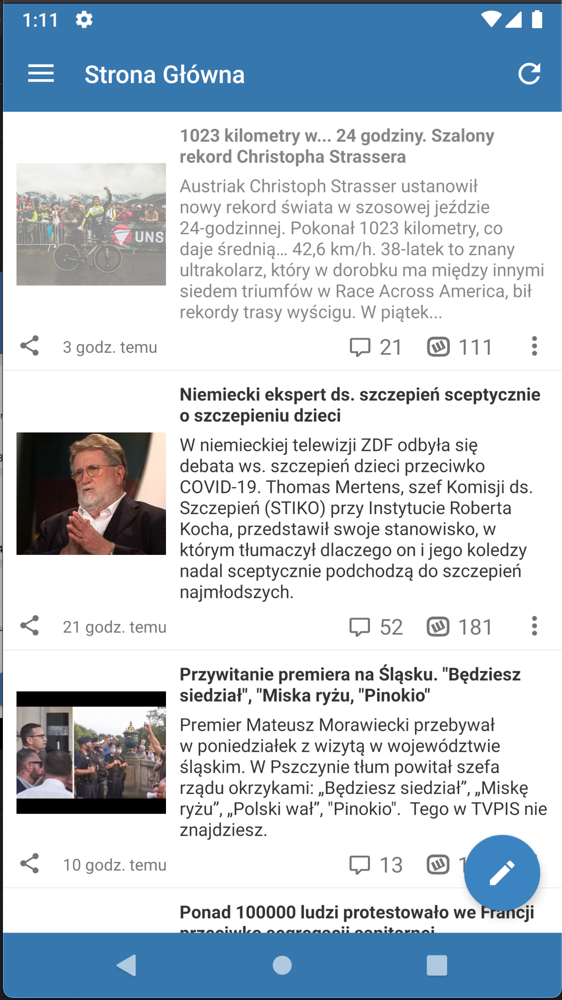
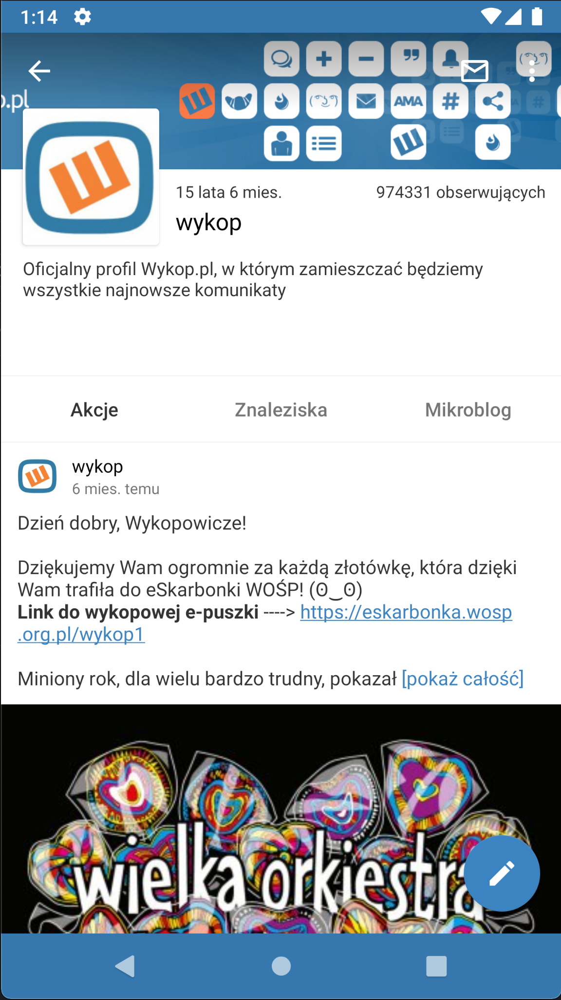
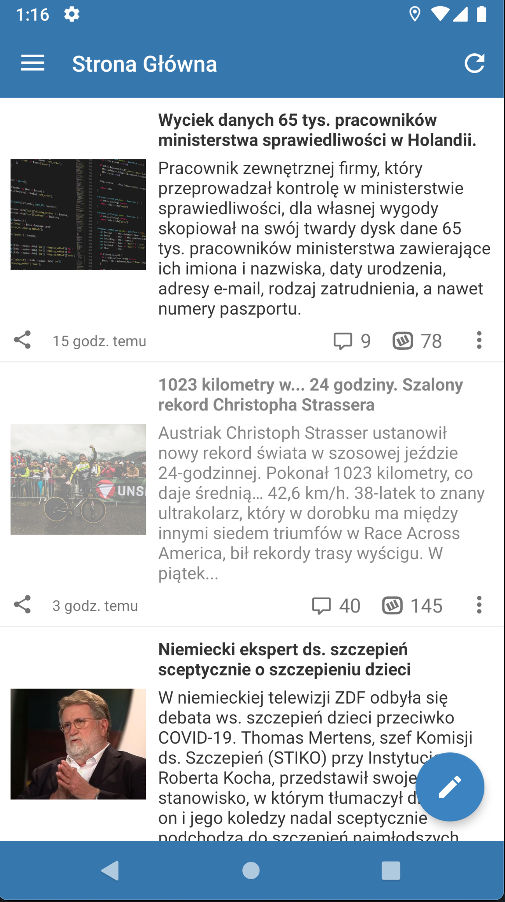
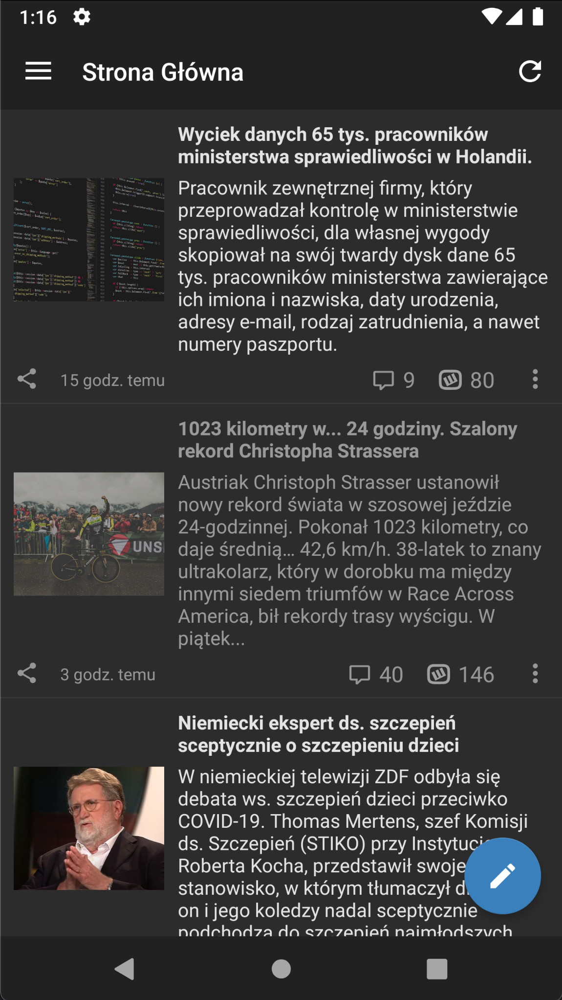
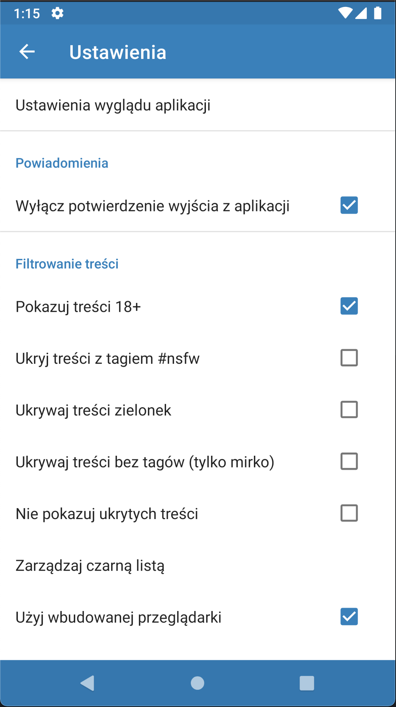
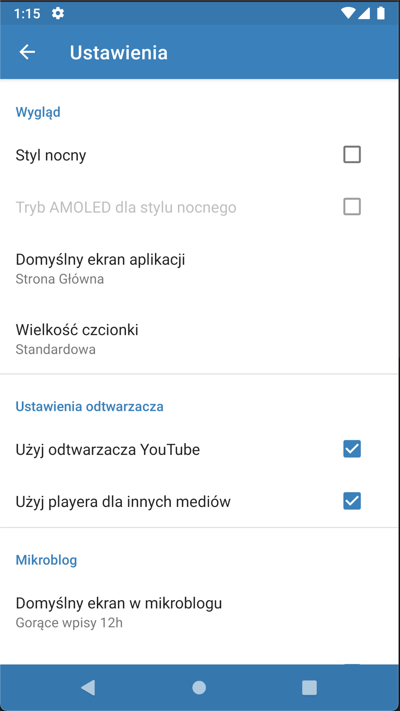

# Wykop Mobilny [Revived] 📱

> Second iteration of unofficial wykop.pl client for Android, written in Kotlin.

## Features

|Entries/Links|Details|Profile|
|---|---|---|
||||

|Light|Dark|Amoled|
|---|---|---|
||||

|Customize Behavior|Customize Appearance|
|---|---|
|||

## How to contribute
