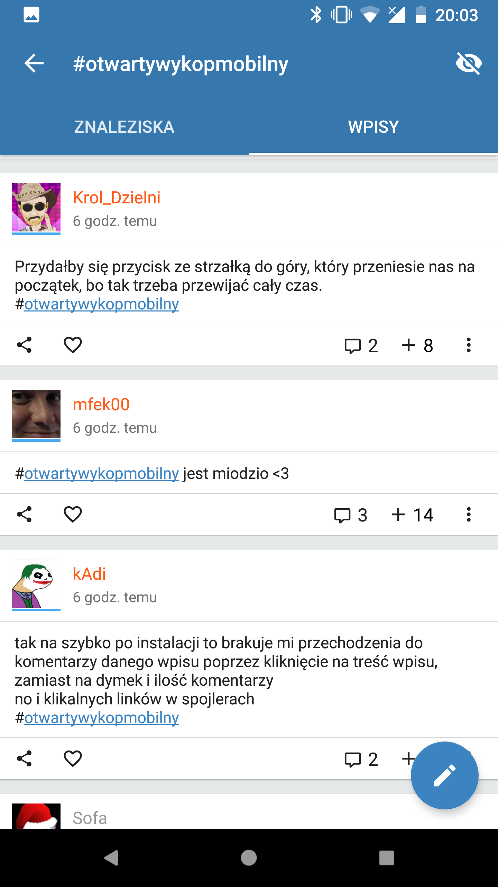

# Wykop Mobilny 📱

[![Build Status][build-badge]][build]
[![Discord][discord-badge]][discord]
[![Support via PayPal][paypal-badge]][paypal]

> Unofficial [wykop.pl][wykop] client for Android, written in Kotlin.

[Przeczytaj w języku polskim.][readme-pl]

## Features

- Browse link feed (Main page, Upcoming, Favorite, Tags)
- Browse entries (MyWykop, Favorite, Hot, Newest, Tags)
- Microblog
- Search entries/links
- Dark theme (gray one and for AMOLEDs)
- Surveys
- Private messages
- Full customization

## Download

You can [download the newest release with built-in update notifier][download-link] or you can get it on Google Play.

[![Google Play Download][google-play-badge]][google-play-download]

## Development

If you want to build your very own version of Wykop Mobilny, copy `credentials.properties.example` to `credentials.properties` and fill it with your API keys. Keep in mind, that application uses API version 2. Version 1 keys are not supported and will not work.

- `apiKey` and `apiSecret` are API keys from Wykop, that shall be obtained [from here][wykop-api] (giving all permissions).
- `googleKey` is an API key for YouTube player. It shall be obtained following [those developers.google.com instructions][youtube-api].

## Changelogs

Usually I report all progress along with changelogs on [#otwartywykopmobilny on Wykop][wykop-tag].

[build-badge]: https://travis-ci.org/feelfreelinux/WykopMobilny.svg?branch=master
[build]: https://travis-ci.org/feelfreelinux/WykopMobilny
[discord-badge]: https://img.shields.io/discord/455024671440633857.svg
[discord]: https://discord.gg/WgQZJD3
[paypal-badge]: https://img.shields.io/badge/Donate-PayPal-green.svg
[paypal]: https://www.paypal.me/WykopMobilny/
[wykop]: https://wykop.pl
[readme-pl]: README.pl.md
[download-link]: https://github.com/feelfreelinux/WykopMobilny/releases/latest
[google-play-badge]: https://play.google.com/intl/en_us/badges/images/badge_new.png
[google-play-download]: https://play.google.com/store/apps/details?id=io.github.feelfreelinux.wykopmobilny
[wykop-api]: https://www.wykop.pl/dla-programistow/nowa-aplikacja/
[youtube-api]: https://developers.google.com/youtube/android/player/register
[wykop-tag]: https://wykop.pl/tag/otwartywykopmobilny
